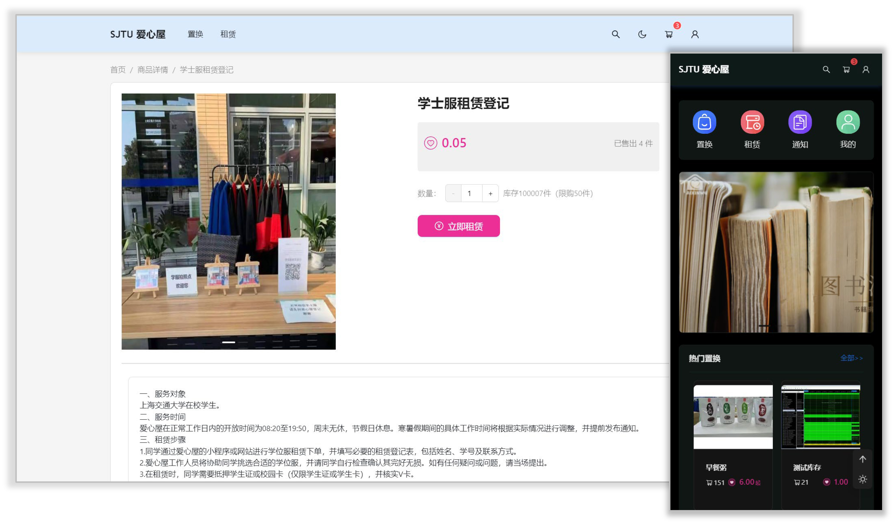

## SJTU Aixinwu Frontend

[Production Deployment](https://aixinwu.sjtu.edu.cn/) | [Backend (Forked from Saleor)](https://github.com/ChatSJTU/Aixinwu-core) | [Dashboard](https://github.com/ChatSJTU/Aixinwu-dashboard)

A public welfare idle goods circulation platform on campus, currently in use at Shanghai Jiao Tong University. Here is the source code repo for frontend.

> 本仓库是上海交通大学官方校内物品闲置平台“绿色爱心屋”网站源码的前端部分



### Features

* Modern UI design, using Ant Design
* Support mobile and desktop responsive layout
* Support dark and light mode
* OAuth login and context management

### Getting Started for Devlopment

The frontend uses React, NextJS with Typescript. Please make sure you have `node>=20`.

```bash
cd frontend
npm install
```

To launch a development server, use

```bash
npm run dev
```

To launch a production server, use

```bash
npm run build
npm run start
```

As for backend development, please see [here](https://github.com/ChatSJTU/Aixinwu-core). The front and back ends interact using GraphQL.